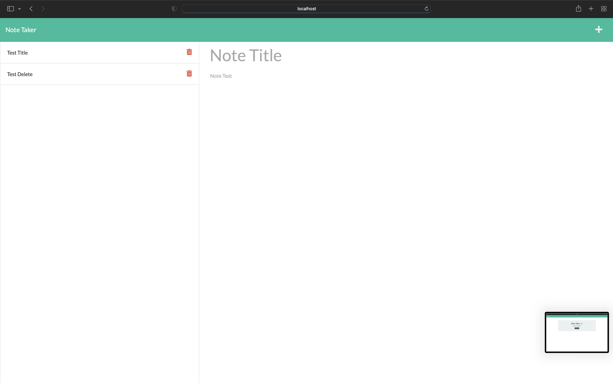

# Note Taker
  
  

## Table Of Contents
1. [Description](#description)
2. [Installation](#installation)
3. [Usage](#usage)
4. [Herokue](#heroku-deployment)
5. [Screenshot](#Screenshot)
6. [License](#license)
7. [Contact Me](#contact-me)
    
  ## Description
   This app is a note taking app that uses Express.js to render the functionality to the front end. The user is able to create notes and have notes save to view at a later time. 

  ## Installation
To install this project the user can clone my git repository.
*You will can install the NPM node package manager by running the following command in the command line "npm init" if you'd like to autocomplete the questions that are asked you can run "npm init -y" instead. 
* The user can run the command "npm start" and they will see a message in the cli that has a link to the port in which they can utilize the ap. 
* This app is also deplpyed to Heroku so the user can view the deployment in the Heroku Deployment section. 

  ## Usage
  Once the user has navigated to localhost:3001 they will see the Note Taker homepage. If the user clicks on the button that says "Get Started" they will directed to the secondary page. This page allows the user to create a new note in the right hand column and view previous notes in the left hand column. If the user has previous notes that they would like to view they can click on a specific note in the left hand column to view it in a larger format in the right hand column. If the user would like to create new note they can click on the plus sign in the top right hand corner to open up a new textarea to input a new note. 

  ## Heroku Deployment

    

  ## Screenshot
  
  

  ## License
  The project is protected under the MIT license. Please follow the following link if you'd like more details about this license https://choosealicense.com/licenses/mit/

  ## Contact Me
  GitHub: https://github.com/rarellano5280

  Email: robertarellano26@yahoo.com
